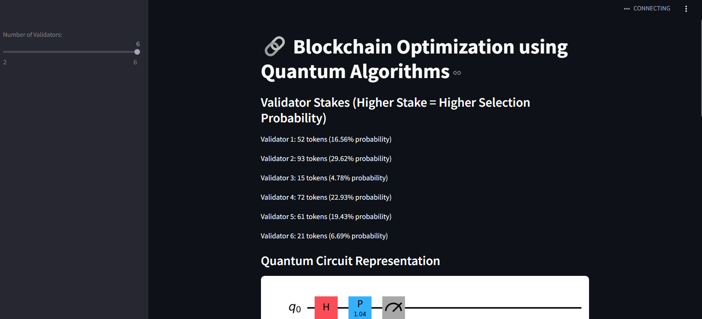
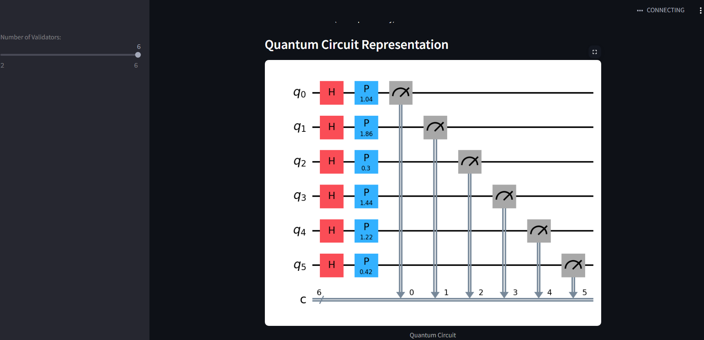
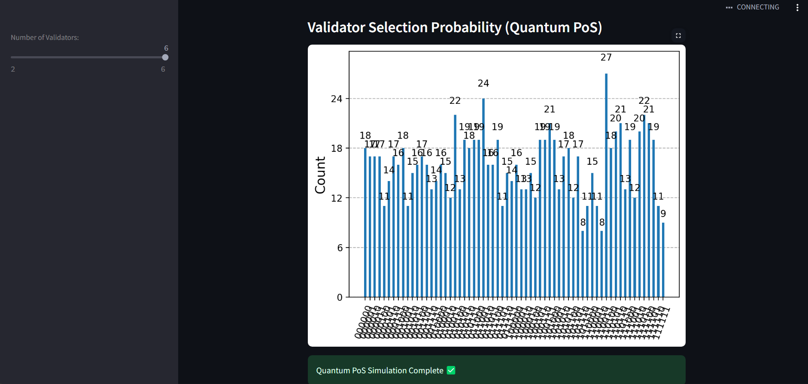

# Quantum POS System
# Quantum POS System
📌 Quantum POS System
The Quantum Point of Sale (POS) System leverages Quantum Computing to enhance the security and efficiency of transactions. Traditional POS systems rely on classical encryption techniques, which can be vulnerable to evolving cyber threats. By integrating Qiskit, this system employs Quantum Key Distribution (QKD) and quantum randomness to offer an unparalleled level of security and computational efficiency.

🚀 Why Use Quantum Computing in a POS System?
🔐 Unbreakable Security:

Uses Quantum Key Distribution (QKD) to establish unhackable encryption keys, unlike classical encryption which is vulnerable to brute force attacks.
Quantum Entanglement ensures that any interception attempt alters the data, making fraud detection instantaneous.
⚡ Faster Transaction Processing:

Quantum algorithms optimize the verification and encryption of transactions, reducing the computational overhead seen in classical systems.
Can quickly validate multiple transactions in parallel, unlike traditional sequential processing.
🌐 Future-Proof Technology:

As quantum computers advance, traditional cryptographic systems will become obsolete, while Quantum Cryptography remains secure.
Reduces reliance on classical computing limitations, making the system more scalable and adaptable.
📉 Fraud Prevention:

Quantum Random Number Generators (QRNGs) ensure that every transaction has a truly unpredictable encryption key.
No two transactions use the same encryption method, making man-in-the-middle attacks nearly impossible.
By integrating Qiskit and quantum cryptographic methods, this system ensures that every transaction is not just secure, but also optimized for speed, accuracy, and future-proof protection against quantum attacks. 🚀

🛠 Installation Steps
Clone the repository

git clone https://github.com/Yogitha-Turumella/Quantum-Pos-Quantum.git
cd Quantum-Pos-Quantum
Create a virtual environment

python -m venv qiskit-env
Activate the virtual environment

Windows (PowerShell)
qiskit-env\Scripts\Activate

Mac/Linux
source qiskit-env/bin/activate

Install dependencies
pip install -r requirements.txt

Run the application
streamlit run app.py

📸 Screenshots
1️⃣ Quantum Circuit Creation

2️⃣ Quantum Computation Processing

3️⃣ Final Output Result

To make the screenshots appear correctly, you must save them inside an assets/ folder.

📜 Features
✅ Secure transactions using quantum encryption
✅ Uses Qiskit for quantum computations
✅ Simulates Quantum Key Distribution (QKD)

📌 Technologies Used
Python 🐍
Qiskit ⚛️
Flask 🌐
PostgreSQL 🛢️
📩 Contribution
If you’d like to contribute, fork this repo and create a pull request! 🚀

